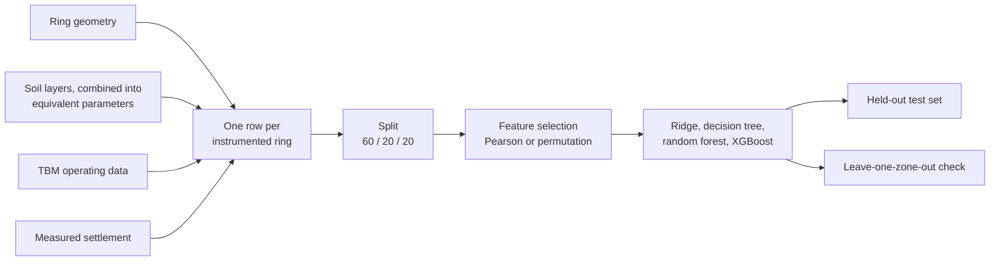

# Predicting surface settlement from tunnel boring data

First-year research project at École des Ponts (Paris), February to March 2026, by Wadhah Ben Esghaier, Amaury Michaux, Gaultier Oriol and Johann Roiron-Brown.

When a tunnel boring machine (TBM) digs under a city, the ground above it settles by a few millimetres. We used real data from a metro tunnel in the Paris region to predict that settlement, ring by ring, from the machine's operating parameters and the soil around the tunnel.

> **About the data.** The real data belongs to a private company and is confidential. This repository contains none of it, and nothing computed from it. The notebooks run on a synthetic dataset with the same structure, so every number and figure in them is synthetic.

## Pipeline



## What we found on the real data

Only qualitative results are shared here, since the numbers come from confidential data.

- **Tree ensembles far outperformed a linear baseline.** The best model was a random forest on six variables selected by permutation importance.
- **Permutation importance picked better variables than Pearson correlation.** Settlement depends on the variables non-linearly, which a linear correlation misses.
- **The soil mattered most.** Cohesion and the Ménard pressuremeter modulus ranked first, ahead of the TBM's total thrust and face pressure.
- **But the model did not carry over well to a new stretch of tunnel.** Neighbouring rings have nearly the same soil, settings and settlement, so a random split flatters the model. With whole instrumented zones held out, a check added when publishing, the error rose sharply and came close to that of always predicting the mean settlement. The model interpolates within a zone; predicting settlement on unseen ground remains an open problem.

## Method

1. **Dataset.** One row per instrumented ring: the measured settlement, 6 TBM parameters (advance rate, cutterhead torque, total thrust, face pressure, grout pressure and volume) and 6 equivalent soil parameters (unit weight, Ménard modulus, rheological coefficient, cohesion, friction angle, K0). The equivalent parameters combine the soil layers above the tunnel with a formula adapted from Chen et al. (2019).
2. **Split.** 60 % training, 20 % validation, 20 % test. Missing values are imputed inside the model pipeline, so only from training data.
3. **Feature selection.** Keep 6 of the 12 variables, either by Pearson correlation with the settlement or by permutation importance in a random forest. The test set is not used.
4. **Models.** A ridge regression as the linear baseline, then a decision tree, a random forest and XGBoost, each tuned by grid search with 10-fold cross-validation.
5. **Generalisation check.** Leave-one-zone-out cross-validation: each instrumented zone is predicted by a model that has never seen it, and compared with a baseline that always predicts the mean.

## Synthetic data

`scripts/make_synthetic_data.py` builds 4,000 rings with the same tables and columns as the real data. The values are invented from generic geotechnical orders of magnitude, and nothing is fitted to the real data. Settlement is a made-up function of soil stiffness, face pressure deficit, grout volume and depth, plus a random effect per instrumented zone, so that the notebooks behave sensibly. Their results say nothing about the real tunnel.

## Repository

```
notebooks/
  01_exploration.ipynb        tables, geological long section, TBM and soil parameters, settlement
  02_modelisation.ipynb       feature selection, models, test set, generalisation check
scripts/
  make_synthetic_data.py      builds data/synthetic/
data/
  synthetic/                  synthetic dataset used by the notebooks
  README.md                   tables and columns
```

The notebooks are in French.

## Running it

```bash
pip install -r requirements.txt
```

Then run the notebooks in order from the `notebooks/` folder. `python scripts/make_synthetic_data.py` regenerates the synthetic data. Team members with access to the real data can point the notebooks at it by setting `TUNNEL_DATA` to the folder that holds the CSV files.

## How the code was written

During the project, we wrote the code mostly by hand, with corrections from Gemini Flash (the version available at the time).

## Clean-up and publication

Claude (Anthropic) assisted Amaury Michaux with cleaning up and publishing this repository. It:

- merged the team's notebooks into the two in `notebooks/` and restructured them;
- rebuilt the final analysis from the figures of our report, since that code was in none of the notebooks;
- fixed an undefined variable that stopped a notebook, identifier columns used as model features, and imputation and feature selection done before the train/test split;
- added the leave-one-zone-out check (section 8 of `02_modelisation.ipynb`);
- wrote `scripts/make_synthetic_data.py`, and removed from the repository everything that came from the confidential data;
- wrote this README, `data/README.md` and `requirements.txt`;
- created the GitHub repository and pushed it.
